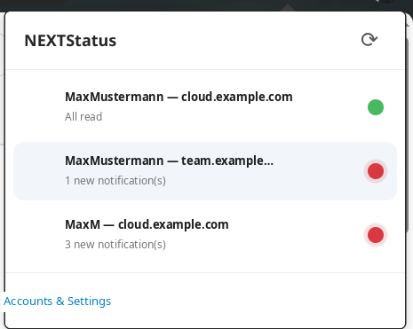
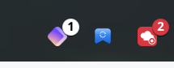
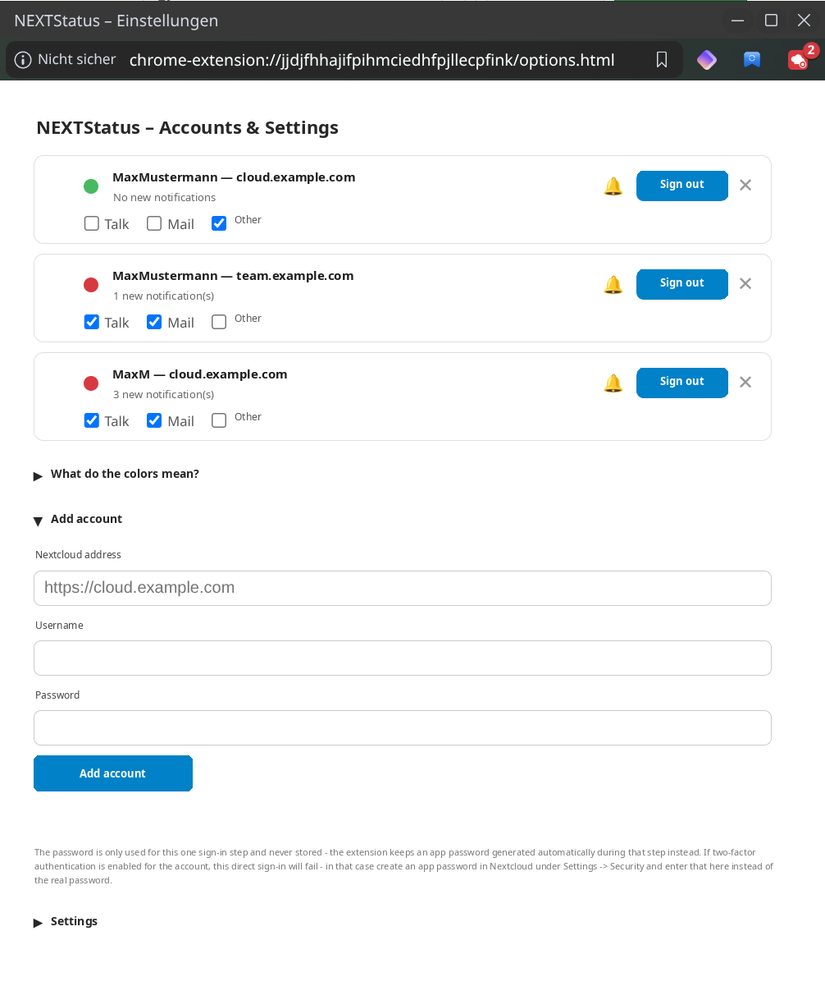
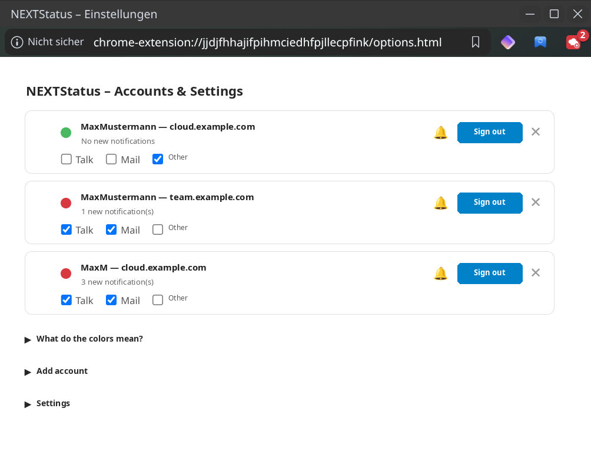
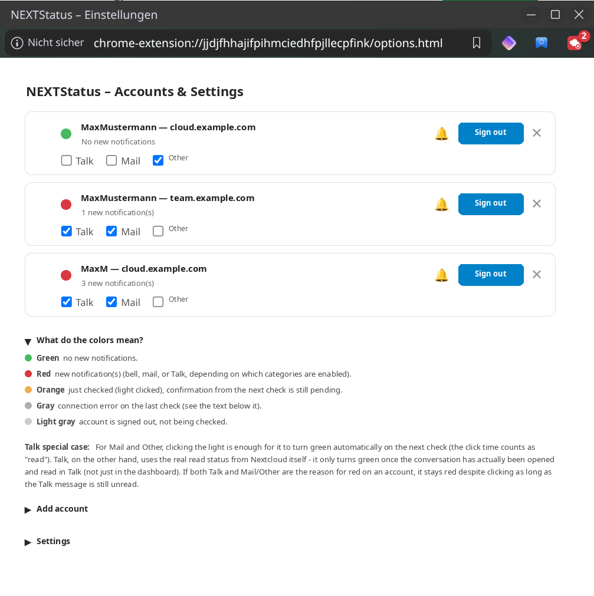
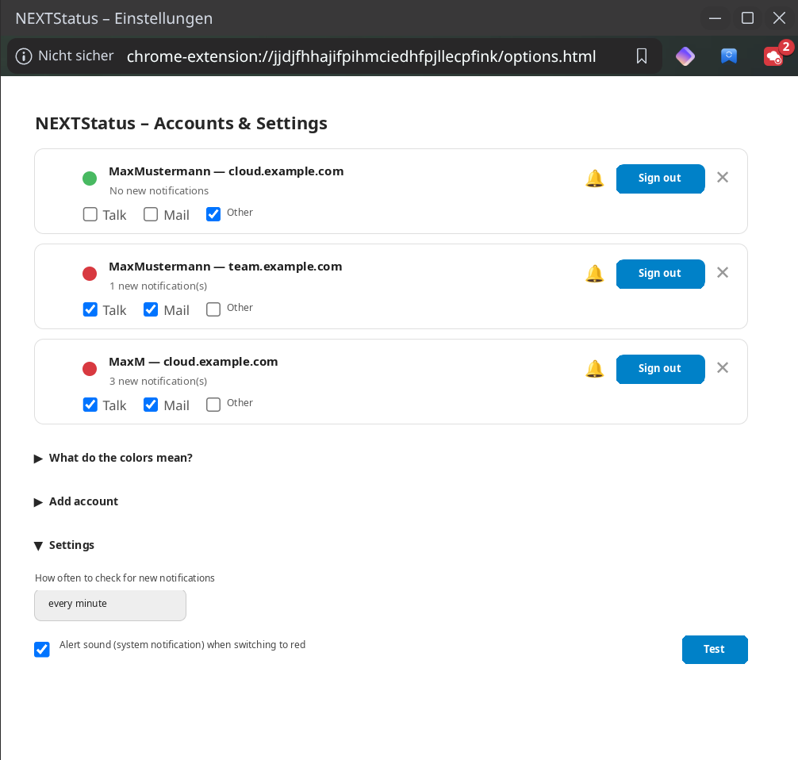

[Deutsch](README.md) | [English](README.en.md)

# NEXTStatus

Browser extension (Chrome & Firefox) for multiple Nextcloud accounts: one
click on the icon shows each account's favicon and a traffic light – green
when nothing new is waiting, red as soon as new notifications are ready.
Clicking a light opens that account's dashboard in a new tab.

This project was built together with [Claude](https://claude.com).



## How it works

- Every check runs directly against the Nextcloud APIs (Notifications +
  Talk) using an app-specific password – independent of whether the
  browser currently has a web session open for that Nextcloud.
- Sign-in happens with username + password directly in the extension;
  the real password is never stored (see "Add an account" below).
- Clicking a light opens the dashboard and immediately switches it to
  **orange** ("just checked, confirmation pending"); the next check then
  confirms it as green, or shows red again if the actual trigger (e.g. a
  still-unread Talk message) hasn't actually been resolved yet.
- Configurable per account: which sources count (Talk / Mail / Other),
  alert sound on/off, sign out without losing the entry.

The interface is bilingual (German/English, `_locales/`) and follows the
browser's UI language automatically; every other language falls back to
English (`default_locale` in `manifest.json`).

## Folder structure

```
NEXTStatus/
└── browser-extension/
    ├── manifest.json              # extension configuration
    ├── background.js              # check logic, account management, sign-in (core)
    ├── browser-polyfill-shim.js   # chrome.* -> browser.* (promises) for Chrome/Vivaldi
    ├── offscreen.html / offscreen.js  # sound playback in Chrome (service worker has no DOM)
    ├── popup.html / popup.js      # popup with the account list
    ├── options.html / options.js  # "Accounts & Settings" window
    ├── i18n.js                    # applies _locales/ text to data-i18n elements
    ├── _locales/de, _locales/en   # translations
    ├── sounds/alert.mp3           # alert sound
    └── icons/                     # icon (blue) + alert variant (red)
```

## 1. Load the extension (unpacked/temporary)

**Chrome / Vivaldi / Edge:**
1. Open `chrome://extensions`
2. Enable "Developer mode" (top right)
3. Click "Load unpacked"
4. Select this folder: `browser-extension`

   

**Firefox:**
1. Open `about:debugging#/runtime/this-firefox`
2. "Load Temporary Add-on"
3. Select the file `browser-extension/manifest.json`

(Firefox removes temporarily loaded add-ons again on restart – for
permanent use the extension would need to be signed, or installed via
`about:config` with `xpinstall.signatures.required = false` in a
developer/ESR build.)

## 2. Add an account

1. Click the icon → "Accounts & Settings" (opens the settings)
2. Under "Add account", enter the Nextcloud address, username, and
   password
3. The browser asks once whether the extension may access this address
   → allow it
4. Click "Add account"

   

The entered password is only used for this one sign-in step (Nextcloud
endpoint `getapppassword`) and never stored – the extension keeps an
app-specific password generated automatically during that step instead,
which can be revoked individually at any time in Nextcloud under
*Settings → Security → Connected browsers/devices*.

**Two-factor authentication:** if 2FA is enabled for the account, this
direct sign-in will fail. In that case, create an app password manually
in Nextcloud under *Settings → Security* and enter that instead of the
real password.

Repeat the process for further accounts (including multiple users of the
same Nextcloud) – since no browser session/cookies are used here, this
works fine even for a second user on the same server.

## 3. Usage

- Click the icon → list of all accounts with favicon + traffic light
- Green = no new notifications, red = new notifications (the badge
  number = number of accounts with new notifications; the icon itself
  also switches to red)
- Clicking a row opens that account's dashboard in a new tab and
  immediately switches the light to **orange** ("just checked,
  confirmation pending") – the click time already counts as "seen"
- The next check (interval, or immediately when the tab is closed) then
  confirms it as green – or shows red again if something new arrived in
  the meantime, or if the actual trigger (e.g. a still-unread Talk
  conversation) hasn't actually been resolved yet
- Checks run every 5 minutes by default (configurable in settings); "⟳"
  in the popup checks immediately

## 4. Manage accounts & settings

The "Accounts & Settings" button opens its own window that automatically
resizes to fit its content (no extra browser tab). Clicking it again just
brings an already-open window to the front instead of opening another
one.



The following actions are available per account:

- **🔔/🔕 Alert sound:** turns the alert sound on/off for this one
  account only – the account still counts normally for red/green and the
  badge, it just stays silent.
- **Sign out:** removes/revokes the app password; the entry (server,
  username, favicon) stays in the list. Signed-out accounts are no
  longer checked; "Sign in again" reactivates the account without having
  to retype the server address/username.
- **✕ remove:** deletes the entry permanently (also attempts to revoke
  the app password on the server first).
- **Talk / Mail / Other (checkboxes):** sets per account which sources
  are allowed to turn the light red. Disabled categories simply don't
  count (Talk isn't even queried anymore in that case) – this only
  affects the traffic light, not what counts as a notification in
  Nextcloud itself.

A collapsible "What do the colors mean?" section explains every state
right inside the extension:



And under "Settings": the check interval as well as the alert sound with
a "Test" button that immediately triggers a test notification with sound,
regardless of the current on/off state:



The alert sound plays a bundled sound file (`sounds/alert.mp3`) directly
inside the extension – in addition to the normal system notification, but
independent of it. This was necessary because some browser/desktop
combinations (e.g. Vivaldi on Linux) show notifications only as their own,
silent browser popup instead of a real system notification with sound. In
Chrome/Vivaldi, playback briefly runs through an invisible "offscreen
document" (`offscreen` permission); in Firefox it runs directly in the
background script.

## Technical background

- Detecting "new information" = unread entries from the Nextcloud
  Notifications API (`/ocs/v2.php/apps/notifications/api/v2/notifications`,
  the same source as the bell icon in the Nextcloud web UI) **plus**
  Talk mentions straight from the Talk API
  (`/ocs/v2.php/apps/spreed/api/v4/room`, field `unreadMention` per
  conversation – in one-on-one conversations, every new message
  automatically counts as a mention). Deliberately only mentions, not
  every new message in every group – otherwise the light would stay red
  constantly in active group chats even when you're not actually the one
  addressed. If the Talk app isn't installed, this is silently skipped
  (not treated as an error).
  **Note:** for Talk messages, the actual read status in Nextcloud itself
  is what counts (only turns green once the conversation has really been
  opened in Talk) – unlike the bell, simply closing the dashboard tab is
  not enough here.
- There's no dedicated check for new emails (Mail app) – the Mail app
  needs its own notification option enabled for new emails to also show
  up in the bell (and therefore here).
- Signing in with username/password calls the Nextcloud endpoint
  `getapppassword` once via Basic Auth and receives an app password in
  return – the real password is never stored. Doesn't work with
  two-factor authentication enabled (see above).
- Credentials (app password per account) are stored unencrypted in
  `browser.storage.local` – as with any browser extension, this is
  protected by the OS/profile login but not separately encrypted. If the
  device is lost, the app password should be revoked in Nextcloud.
- Cross-browser compatibility: `browser-polyfill-shim.js` ensures the
  same code can consistently use `browser.*` (promises), even in
  browsers that only offer the older, callback-based `chrome.*`.
  `manifest.json` deliberately lists both `service_worker`
  (Chrome/Vivaldi/Edge/Brave/Opera) and `scripts` (needed by Firefox for
  MV3 background scripts, since Firefox doesn't use a real service worker
  there) for the background process.

## Known limitations

- Talk detection requires actually reading the conversation in Talk (see
  above) – that's intentional (it reflects the real state), but can be
  surprising if you've only visited the dashboard.
- Mail detection depends on a notification option being enabled in the
  Nextcloud Mail app; there's no dedicated query against the Mail app's
  own API.
- Credentials are stored unencrypted in `browser.storage.local` (see
  "Technical background" above).

## Reporting bugs

Please file bugs and ideas for next steps as an issue:
[github.com/Stephan-Lefty/nextstatus/issues](https://github.com/Stephan-Lefty/nextstatus/issues).

## Privacy

See [PRIVACY.en.md](PRIVACY.en.md) for the browser extension's privacy
policy.

## License

MIT, see [LICENSE](LICENSE).
