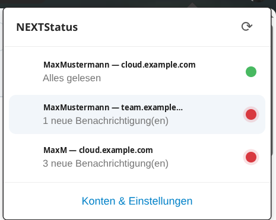
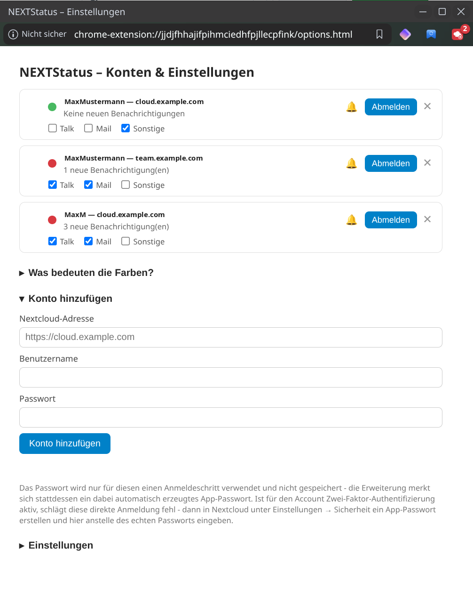
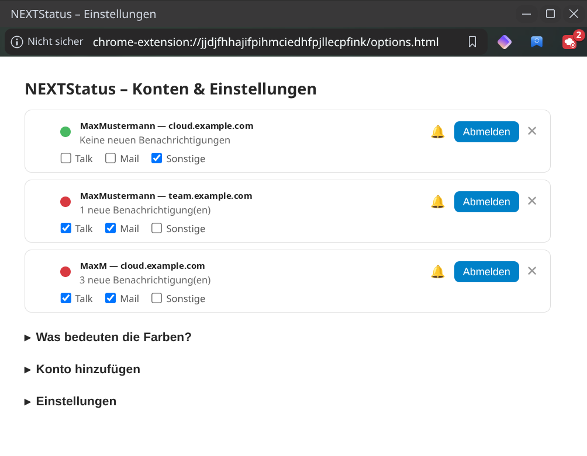
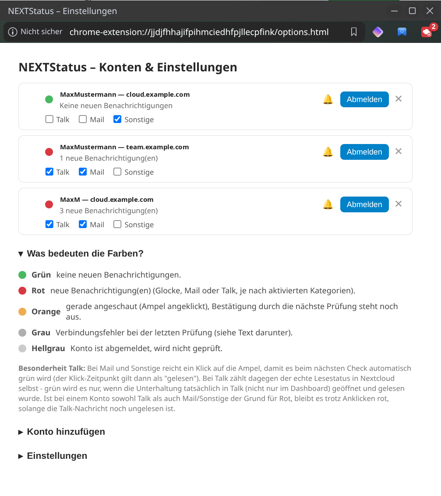
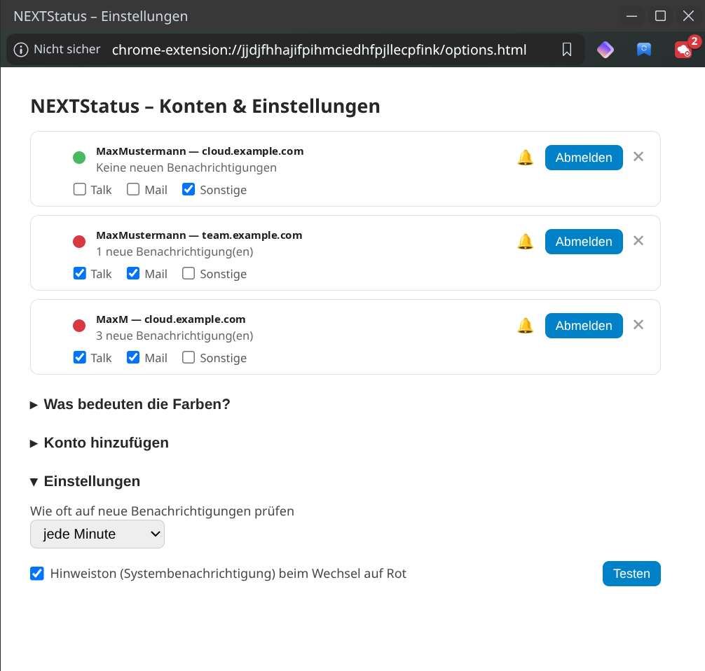

[Deutsch](README.md) | [English](README.en.md) | [Änderungsprotokoll](#änderungsprotokoll)

# NEXTStatus

Browser-Erweiterung (Chrome & Firefox) für mehrere Nextcloud-Konten: Ein
Klick auf das Symbol zeigt pro Konto das Favicon und eine Ampel – grün,
wenn nichts Neues anliegt, rot, sobald neue Benachrichtigungen bereitstehen.
Klick auf eine Ampel öffnet das jeweilige Dashboard in einem neuen Tab.

Dieses Projekt ist in Zusammenarbeit mit [Claude](https://claude.com) entstanden.



## Wie es funktioniert

- Jede Prüfung läuft direkt gegen die Nextcloud-APIs (Notifications + Talk)
  mit einem App-spezifischen Passwort – unabhängig davon, ob im Browser
  gerade eine Web-Sitzung bei der jeweiligen Nextcloud besteht.
- Die Anmeldung läuft mit Benutzername + Passwort direkt in der
  Erweiterung; das echte Passwort wird dabei nie gespeichert (siehe
  "Konto hinzufügen" unten).
- Klick auf eine Ampel öffnet das Dashboard und setzt sie sofort auf
  **Orange** ("angeschaut, Bestätigung steht noch aus"); der nächste
  Prüf-Durchlauf bestätigt das dann als Grün oder zeigt erneut Rot, falls
  der eigentliche Auslöser (z.B. eine noch ungelesene Talk-Nachricht)
  tatsächlich noch nicht erledigt ist.
- Pro Konto einzeln einstellbar: welche Quellen zählen (Talk / Mail /
  Sonstige), Hinweiston an/aus, Abmelden ohne den Eintrag zu verlieren.

Die Oberfläche ist mehrsprachig (Deutsch/Englisch, `_locales/`) und richtet
sich automatisch nach der Sprache des Browsers; alle anderen Sprachen
fallen auf Englisch zurück (`default_locale` in `manifest.json`).

## Ordnerstruktur

```
NEXTStatus/
└── browser-extension/
    ├── manifest.json              # Extension-Konfiguration
    ├── background.js              # Prüf-Logik, Konten-Verwaltung, Login (Kernstück)
    ├── browser-polyfill-shim.js   # chrome.* -> browser.* (Promises) für Chrome/Vivaldi
    ├── offscreen.html / offscreen.js  # Sound-Wiedergabe in Chrome (Service Worker hat kein DOM)
    ├── popup.html / popup.js      # Popup mit der Kontenliste
    ├── options.html / options.js  # "Konten & Einstellungen"-Fenster
    ├── i18n.js                    # Überträgt _locales/-Texte auf data-i18n-Elemente
    ├── _locales/de, _locales/en   # Übersetzungen
    ├── sounds/alert.mp3           # Hinweiston
    └── icons/                     # Symbol (blau) + Alarm-Variante (rot)
```

## 1. Erweiterung laden (unpacked/temporär)

**Chrome / Vivaldi / Edge:**
1. `chrome://extensions` öffnen
2. Oben rechts „Entwicklermodus“ aktivieren
3. „Entpackte Erweiterung laden“ klicken
4. Diesen Ordner auswählen: `browser-extension`

   

**Firefox:**
1. `about:debugging#/runtime/this-firefox` öffnen
2. „Temporäres Add-on laden“
3. Datei `browser-extension/manifest.json` auswählen

(Firefox entfernt temporär geladene Add-ons beim Neustart wieder – für
dauerhafte Nutzung müsste die Erweiterung signiert/über `about:config`
mit `xpinstall.signatures.required = false` in einer Entwickler-/ESR-
Version installiert werden.)

## 2. Konto hinzufügen

1. Auf das Symbol klicken → „Konten & Einstellungen“ (öffnet die
   Einstellungen)
2. Unter „Konto hinzufügen“ Nextcloud-Adresse, Benutzername und Passwort
   eintragen
3. Der Browser fragt einmalig, ob die Erweiterung auf diese Adresse
   zugreifen darf → erlauben
4. „Konto hinzufügen“ klicken

   

Das eingegebene Passwort wird dabei nur für diesen einen Anmeldeschritt
verwendet (Nextcloud-Endpunkt `getapppassword`) und nicht gespeichert –
die Erweiterung merkt sich stattdessen ein dabei automatisch erzeugtes,
App-spezifisches Passwort, das in Nextcloud unter *Einstellungen →
Sicherheit → Verbundene Geräte* jederzeit einzeln widerrufbar ist.

**Zwei-Faktor-Authentifizierung:** Ist für den Account 2FA aktiv, schlägt
diese direkte Anmeldung fehl. In dem Fall stattdessen in Nextcloud unter
*Einstellungen → Sicherheit* manuell ein App-Passwort erstellen und
dieses anstelle des echten Passworts in das Passwortfeld eintragen.

Für weitere Konten (auch mehrere Nutzer derselben Nextcloud) den Vorgang
einfach wiederholen – da hierbei keine Browser-Sitzung/Cookies verwendet
werden, funktioniert das problemlos auch für einen zweiten Nutzer
desselben Servers.

## 3. Nutzung

- Symbol anklicken → Liste aller Konten mit Favicon + Ampel-Licht
- Grün = keine neuen Benachrichtigungen, Rot = neue Benachrichtigungen
  (Zahl im Badge = Anzahl der Konten mit neuen Benachrichtigungen; das
  Symbol selbst wechselt zusätzlich auf Rot)
- Klick auf eine Zeile öffnet das jeweilige Dashboard in einem neuen Tab
  und schaltet das Licht sofort auf **Orange** ("angeschaut, Bestätigung
  steht noch aus") – der Zeitpunkt gilt schon jetzt als "angeschaut"
- Der nächste Prüf-Durchlauf (Intervall, oder sofort beim Schließen des
  Tabs) bestätigt das dann als Grün – oder zeigt wieder Rot, falls
  zwischenzeitlich etwas Neues dazukam bzw. der eigentliche Auslöser
  (z.B. eine noch ungelesene Talk-Unterhaltung) tatsächlich noch nicht
  erledigt ist
- Geprüft wird standardmäßig alle 5 Minuten (einstellbar in den
  Einstellungen); „⟳“ im Popup prüft sofort

## 4. Konten verwalten & Einstellungen

Der Button „Konten & Einstellungen“ öffnet ein eigenes, sich automatisch
an den Inhalt anpassendes Fenster (kein zusätzlicher Browser-Tab). Ein
erneuter Klick holt ein bereits offenes Fenster nur nach vorne, statt ein
weiteres zu öffnen.



Pro Konto stehen folgende Aktionen zur Verfügung:

- **🔔/🔕 Hinweiston:** schaltet den Hinweiston nur für dieses eine Konto
  aus/ein – das Konto zählt weiterhin normal für Rot/Grün und Badge, es
  bleibt nur still.
- **Abmelden:** entfernt/widerruft das App-Passwort, der Eintrag
  (Server, Benutzername, Favicon) bleibt aber in der Liste stehen.
  Geprüft wird für abgemeldete Konten nicht mehr; „Wieder anmelden“
  reaktiviert das Konto, ohne Server-Adresse/Benutzername neu eintippen
  zu müssen.
- **✕ entfernen:** löscht den Eintrag endgültig (versucht vorher
  ebenfalls, das App-Passwort auf dem Server zu widerrufen).
- **Talk / Mail / Sonstige (Checkboxen):** legt pro Konto einzeln fest,
  welche Quellen das Licht auf Rot schalten dürfen. Ausgeschaltete
  Kategorien zählen einfach nicht mit (Talk wird dann noch nicht mal mehr
  abgefragt) – beeinflusst nur die Ampel, nicht was in Nextcloud selbst
  als Benachrichtigung gilt.

Ein aufklappbarer Bereich „Was bedeuten die Farben?“ erklärt alle
Zustände direkt in der Erweiterung:



Und unter „Einstellungen“: Prüfintervall sowie der Hinweiston mit
„Testen“-Knopf, der unabhängig vom aktuellen Ein/Aus-Zustand sofort eine
Testbenachrichtigung samt Ton auslöst:



Der Hinweiston spielt eine mitgelieferte Sound-Datei (`sounds/alert.mp3`)
direkt in der Erweiterung ab – zusätzlich zur normalen System-
Benachrichtigung, aber unabhängig von ihr. Das war nötig, weil manche
Browser/Desktop-Kombinationen (z.B. Vivaldi unter Linux) Benachrichtigungen
nur als eigenes, stummes Browser-Popup anzeigen statt als echte System-
Benachrichtigung mit Ton. In Chrome/Vivaldi läuft die Wiedergabe dafür
kurz über ein unsichtbares "Offscreen-Dokument" (Berechtigung
`offscreen`), in Firefox läuft sie direkt im Hintergrundskript.

## Technischer Hintergrund

- Erkennung „neue Informationen“ = ungelesene Einträge der Nextcloud
  Notifications-API (`/ocs/v2.php/apps/notifications/api/v2/notifications`,
  dieselbe Quelle wie das Glocken-Symbol in der Nextcloud-Weboberfläche)
  **plus** Talk-Erwähnungen direkt aus der Talk-API
  (`/ocs/v2.php/apps/spreed/api/v4/room`, Feld `unreadMention` je
  Unterhaltung – bei Einzelgesprächen zählt dabei jede neue Nachricht
  automatisch als Erwähnung). Bewusst nur Erwähnungen, nicht jede neue
  Nachricht in jeder Gruppe – sonst würde die Ampel bei aktiven
  Gruppen-Chats ständig rot sein, auch wenn man selbst gar nicht gemeint
  ist. Ist die Talk-App nicht installiert, wird das stillschweigend
  übersprungen (kein Fehler).
  **Achtung:** Für Talk-Nachrichten zählt der tatsächliche Lesestatus in
  Nextcloud selbst (wird erst grün, wenn die Unterhaltung wirklich in
  Talk geöffnet wurde) – anders als bei der Glocke reicht dafür das
  bloße Schließen des Dashboard-Tabs allein nicht aus.
- Für neue E-Mails (Mail-App) gibt es keine eigene Abfrage – die Mail-App
  muss dafür ihre eigene Benachrichtigungs-Option aktiviert haben, damit
  neue E-Mails ebenfalls in der Glocke (und damit hier) auftauchen.
- Anmeldung per Benutzername/Passwort ruft einmalig den
  Nextcloud-Endpunkt `getapppassword` per Basic-Auth auf und erhält
  dabei ein App-Passwort zurück – das echte Passwort wird nie
  gespeichert. Funktioniert nicht bei aktivierter
  Zwei-Faktor-Authentifizierung (siehe oben).
- Zugangsdaten (App-Passwort je Konto) liegen unverschlüsselt in
  `browser.storage.local` – wie bei jeder Browser-Erweiterung ist das
  durch das Betriebssystem-/Profil-Login geschützt, aber nicht separat
  verschlüsselt. Bei Verlust des Geräts sollte das App-Passwort in
  Nextcloud widerrufen werden.
- Cross-Browser-Kompatibilität: `browser-polyfill-shim.js` sorgt dafür,
  dass derselbe Code einheitlich `browser.*` (Promises) nutzen kann –
  auch in Browsern, die nur das ältere, callback-basierte `chrome.*`
  anbieten. `manifest.json` listet für den Hintergrund-Prozess bewusst
  sowohl `service_worker` (Chrome/Vivaldi/Edge/Brave/Opera) als auch
  `scripts` (von Firefox für MV3-Hintergrundskripte benötigt, da Firefox
  dort keinen echten Service Worker nutzt).

## Bekannte Grenzen

- Talk-Erkennung braucht wirkliches Lesen der Unterhaltung in Talk (siehe
  oben) – das ist bewusst so (zeigt den echten Stand), kann aber
  überraschend wirken, wenn man nur das Dashboard besucht hat.
- Mail-Erkennung hängt von einer in der Nextcloud Mail-App aktivierten
  Benachrichtigungs-Option ab; es gibt keine eigene Abfrage der
  Mail-App-API.
- Zugangsdaten liegen unverschlüsselt in `browser.storage.local` (siehe
  "Technischer Hintergrund" oben).

## Änderungsprotokoll

Bezieht sich auf die Versionsnummer der Browser-Erweiterung
(`browser-extension/manifest.json`).

### 0.1.0
Erste veröffentlichte Version (Chrome Web Store und Firefox Add-ons):
- Ampel-Status (Grün/Rot/Orange) für beliebig viele Nextcloud-Konten,
  auch mehrere Nutzer derselben Nextcloud.
- Erkennung über die Notifications-API (Glocke: Mail/Sonstige) und die
  Talk-API (nur echte Erwähnungen, nicht jede Nachricht).
- Anmeldung per Benutzername/Passwort - erzeugt automatisch ein
  App-Passwort, das echte Passwort wird nie gespeichert.
- Pro Konto einzeln: Talk/Mail/Sonstige-Kategorien, Hinweiston an/aus,
  Abmelden ohne Datenverlust, Wieder anmelden.
- Klick auf die Ampel öffnet das Dashboard und schaltet sofort auf
  Orange, bis der nächste Check das bestätigt.
- Eigener, garantiert hörbarer Hinweiston (unabhängig von
  Browser-eigenen Benachrichtigungs-Einstellungen) mit Test-Knopf.
- Einstellungen-Fenster passt sich automatisch an den Inhalt an, holt
  ein bereits offenes Fenster nach vorne statt ein weiteres zu öffnen.
- Deutsch und Englisch.

## Bugs melden

Fehler und Ideen für nächste Schritte bitte als Issue eintragen:
[github.com/Stephan-Lefty/nextstatus/issues](https://github.com/Stephan-Lefty/nextstatus/issues).

## Datenschutz

Siehe [PRIVACY.md](PRIVACY.md) für die Datenschutzerklärung der
Browser-Erweiterung.

## Lizenz

MIT, siehe [LICENSE](LICENSE).
